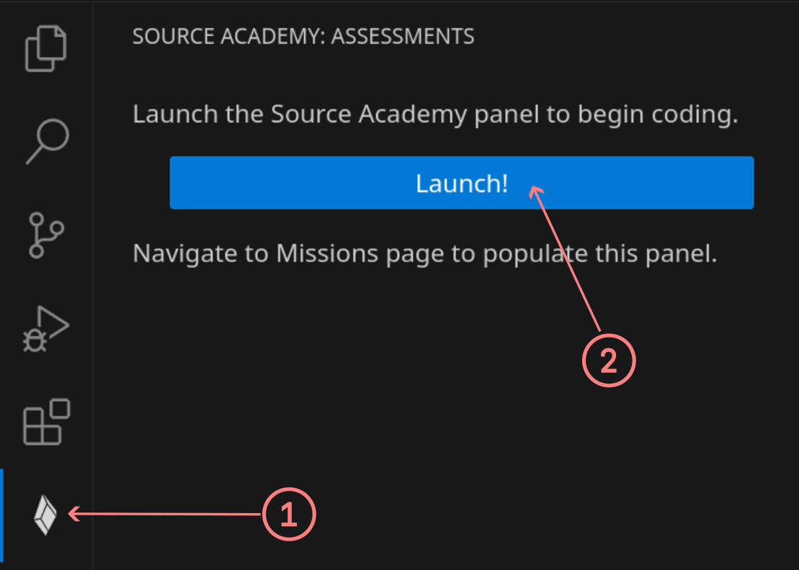

# Source Academy & VS Code

<p align="center">
   
</p>

A Visual Studio Code extension for integration with [Source Academy](https://about.sourceacademy.org), an online experiential environment for computational thinking.

It is available in the VS Code [Extension Marketplace](https://marketplace.visualstudio.com/items?itemName=source-academy.source-academy).

## Features

- View, edit, and submit assessments
- Syntax highlighting for Source
- Integration with our [language server for Source](https://github.com/source-academy/source-lsp), which provides smart features such as:
  - Error checking
  - Code completion
  - Hover documentation

## Installing

If you don't have VS Code installed yet, download it from [here](https://code.visualstudio.com/docs/setup/setup-overview) first.

From within VS Code,

1. Click on the Extensions icon on the left sidebar or the `View: Show Extensions` command (`Ctrl+Shift+X`).
2. Search for "Source Academy" and install it.

We'd recommend also installing the [Error Lens](https://marketplace.visualstudio.com/items?itemName=usernamehw.errorlens) extension
to show diagnostic messages more prominently.

## Getting started

_If you don't have an existing Source Academy account, you can try out our public frontend. See section [Changing the frontend](#changing-the-frontend)._

After installing the extension,

1. Click on the newly-added Source Academy icon on the left sidebar.
2. Launch the Source Academy panel.



Alternatively, use the `Source Academy: Show the Source Academy Panel` command.

Once the panel loads, you'll be prompted to log in. Afterwards, begin coding by opening any assessment.

### Changing the frontend

To use a different Source Academy frontend, modify the Frontend Base URL setting:

1. Press `Ctrl + ,` to open VS Code's settings page, then search for `frontendBaseUrl`.
2. Enter a valid URL.

Example value (public frontend):

```
https://sourceacademy.org
```

## For developers

Check out our [developer guide](./docs/developer-guide.md) for instructions to setup and run the extension from source.
