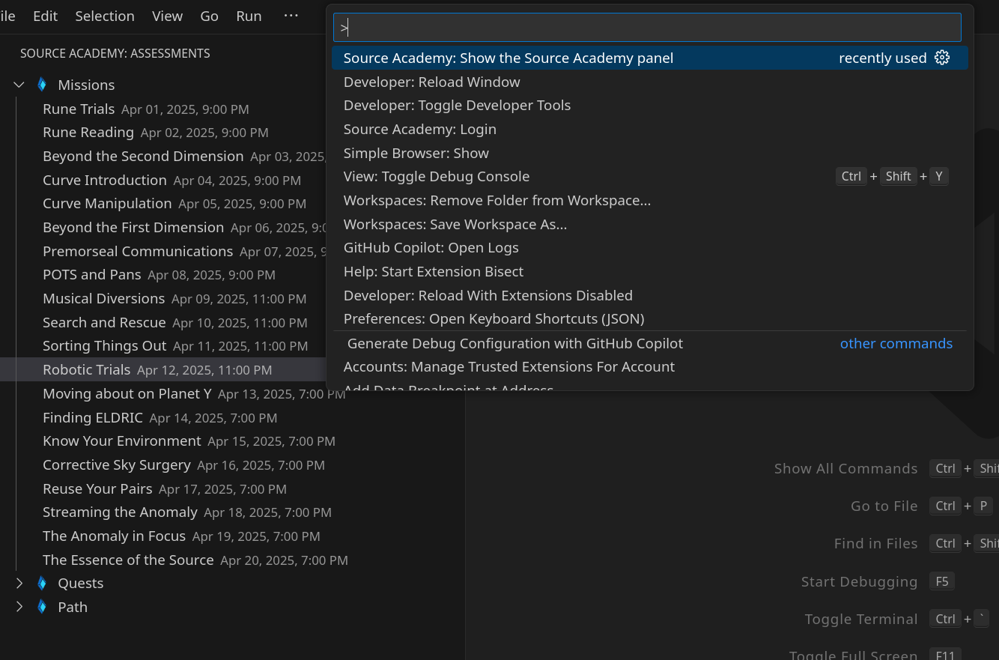

# VS Code

Experimental project for running Source Academy within Visual Studio Code.

## How to use

1. Use the `Ctrl+Shift+P` shortcut to open the Command Palette. Find the "Show the Source Academy Panel" and run it.

2. Log in using the external browser.

3. Use the side panel to select a mission.
